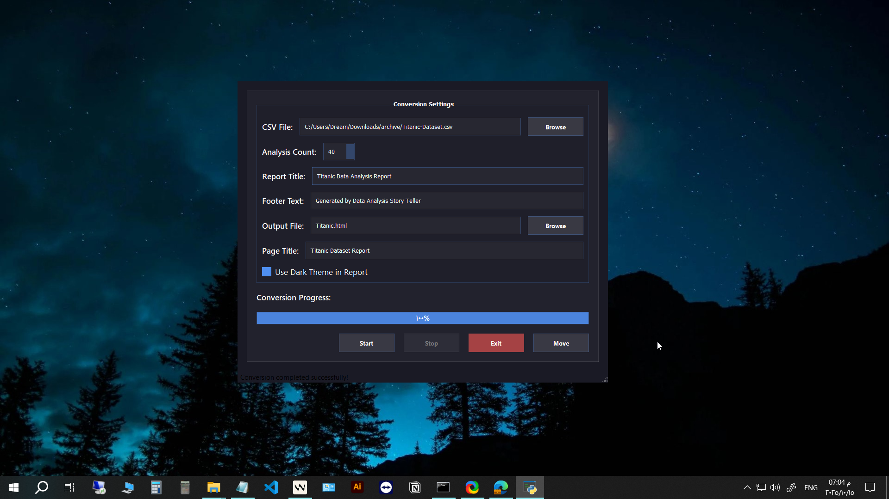
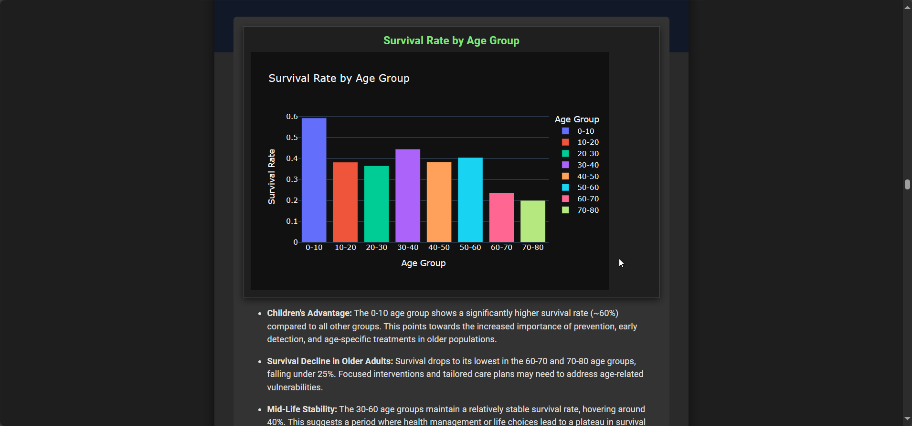
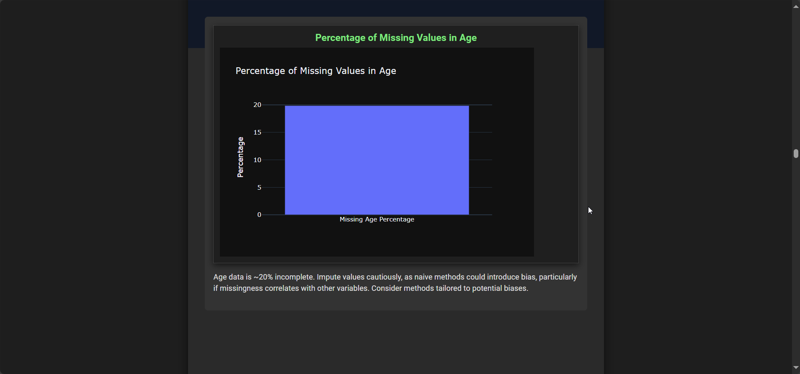
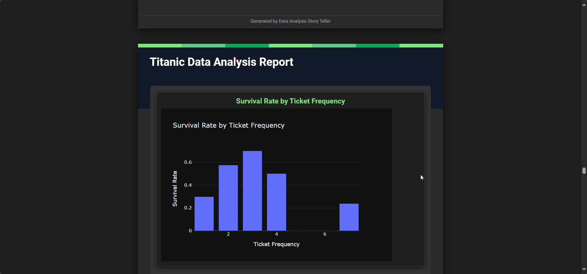

# TheDataAlchemist 🧙‍♂️

[](https://www.python.org/downloads/)
[](https://opensource.org/licenses/MIT)
[](https://www.riverbankcomputing.com/software/pyqt/)
[](https://github.com/joaomdmoura/crewai)
[](https://plotly.com/)

**TheDataAlchemist** is an intelligent, AI-powered desktop application that transforms raw CSV datasets into comprehensive, publication-ready analytical reports. Leveraging advanced multi-agent AI systems, it automates the entire data analysis pipeline from ingestion to insight generation.

## 📋 Table of Contents

- [Features](#features)
- [Installation](#installation)
- [Usage](#usage)
- [Configuration](#configuration)
- [Architecture](#architecture)
- [Project Structure](#project-structure)
- [Demo Materials](#demo-materials)
- [Performance](#performance)
- [Security](#security)
- [Troubleshooting](#troubleshooting)
- [Contributing](#contributing)
- [License](#license)

## 🚀 Features

### 🤖 Multi-Agent AI Architecture
- **Reading Agent**: Intelligently analyzes CSV structure and data characteristics
- **Code Generation Agents**: Creates Plotly visualizations at multiple complexity levels:
  - Simple Analysis (basic charts and distributions)
  - Intermediate Analysis (correlations and trends)
  - Advanced Analysis (complex statistical visualizations)
- **Insights Agent**: Transforms visualizations into compelling narrative stories

### 📊 Automated Analysis Pipeline
- **Intelligent Data Profiling**: Automatically detects column types, distributions, and relationships
- **Dynamic Visualization Generation**: Creates contextually appropriate charts and graphs
- **Narrative Insight Generation**: Converts technical visualizations into business-friendly stories
- **Multi-format Export**: Generates professional HTML reports with interactive visualizations

### 🎨 Professional Report Generation
- **Light & Dark Themes**: Choose between elegant light and modern dark report themes
- **Responsive Design**: Reports adapt to different screen sizes
- **Interactive Visualizations**: Embedded Plotly charts for data exploration
- **Structured Layout**: Clean, publication-ready formatting

## 🛠️ Installation

### Prerequisites
- Python 3.8 or higher
- Valid Google Gemini API key (for AI analysis)
- Git (for cloning repository)

### Setup Instructions

1. **Clone the repository**
   ```bash
   git clone https://github.com/DeepActionPotential/TheDataAlchemist
   cd TheDataAlchemist
   ```

2. **Create virtual environment (recommended)**
   ```bash
   python -m venv venv
   source venv/bin/activate  # On Windows: venv\Scripts\activate
   ```

3. **Install dependencies**
   ```bash
   pip install -r requirements.txt
   ```

4. **Configure API Keys**
   Edit `config.py` and replace placeholder API keys:
   ```python
   api_key: str = "your-actual-gemini-api-key-here"
   ```


## 📖 Usage

### Basic Workflow

1. **Launch Application**: Run `python app.py` to start the GUI
2. **Select Dataset**: Choose any CSV file for analysis via the file dialog
3. **Configure Analysis**:
   - Set number of analyses (default: 50)
   - Choose report title and styling preferences
   - Select light or dark theme
4. **Generate Report**: Click "Analyze & Generate Report"
5. **View Results**: Open the generated HTML report in your browser

### Advanced Configuration

#### Analysis Parameters
```python
# In app.py - adjust analysis parameters
number_of_analyses: int = 50  # More = deeper analysis, longer processing
dark_theme: bool = False      # Toggle dark/light theme
report_title: str = "Custom Report Title"
```

#### API Configuration
The application uses Google Gemini 2.0 Flash by default. Quality and rate limits depend on your API plan:

- **Free Tier**: Limited requests per minute, basic analysis capabilities
- **Paid Tier**: Higher rate limits, more sophisticated insights, better narrative generation

> **Important**: Report quality and analysis depth heavily depend on your Gemini API tier. Free tier may produce basic insights, while paid tiers enable more sophisticated analysis and better narrative generation.

## 🏗️ Architecture

```
┌─────────────────┐    ┌──────────────────┐    ┌─────────────────┐
│   PyQt5 GUI     │───▶│  DatasetAnalyzer │───▶│   Report        │
│   Interface     │    │  (Orchestrator)  │    │   Generator     │
└─────────────────┘    └──────────────────┘    └─────────────────┘
         │                       │                       │
         ▼                       ▼                       ▼
┌─────────────────┐    ┌──────────────────┐    ┌─────────────────┐
│  File Selection │    │  CrewAI Agents   │    │  HTML Templates │
│  & Configuration│    │  - Reading       │    │  - Light Theme  │
└─────────────────┘    │  - Code Gen      │    │  - Dark Theme   │
                       │  - Insights      │    └─────────────────┘
                       └──────────────────┘
```

### Technology Stack
- **Frontend**: PyQt5 (Desktop GUI)
- **AI Framework**: CrewAI (Multi-agent system)
- **LLM Provider**: Google Gemini 2.0 Flash
- **Visualization**: Plotly (Interactive charts)
- **Data Processing**: Pandas (Data manipulation)
- **Report Generation**: HTML/CSS with embedded Plotly

## 📁 Project Structure

```
TheDataAlchemist/
├── 📄 app.py                 # Main application entry point
├── ⚙️ config.py              # API keys and configuration
├── 📦 requirements.txt       # Python dependencies
├── 🧠 agents/                # AI agent implementations
│   ├── reading_agents.py     # Data reading and profiling
│   ├── code_agents.py        # Visualization code generation
│   └── insights_agents.py    # Narrative insight creation
├── 🔧 core/                  # Core business logic
│   └── dataset_manager.py    # Main analysis orchestrator
├── 🔗 services/              # Business services
│   ├── csv_analyses.py       # Dataset analysis coordination
│   └── report_manager.py     # Report generation
├── 🖥️ ui/                    # User interface
│   └── main_ui.py            # PyQt5 GUI implementation
├── 🛠️ utils/                 # Utility functions
│   └── utils.py              # Helper functions
├── 📄 templates/             # HTML report templates
│   ├── report_light_theme.html
│   ├── report_dark_theme.html
│   └── page_block.html
├── 🎬 demo/                  # Demo materials
│   ├── demo.mp4             # Video demonstration (6.6MB)
│   ├── demo1.png           # Screenshot 1: Main interface (1.1MB)
│   ├── demo2.png           # Screenshot 2: Analysis in progress (100KB)
│   ├── demo3.png           # Screenshot 3: Report preview (60KB)
│   ├── demo4.png           # Screenshot 4: Sample visualization (59KB)
│   └── demo5.png           # Screenshot 5: Final report (89KB)
└── 📊 data.csv              # Sample dataset for testing
```

## 🎬 Demo Materials

The `demo/` folder contains comprehensive demonstration materials:

### 📹 Video Demonstration
### Videos
- <video src="./demo/demo.mp4" controls width="720"> </video>


### Images
- `demo1.png` - 
- `demo2.png` - 
- `demo3.png` - 
- `demo4.png` - 


## ⚡ Performance

### Analysis Speed Factors
- **Dataset Size**: Larger files take longer to process (typical: 10-300 seconds)
- **Number of Analyses**: More analyses = longer processing time (50 analyses ≈ 2-5 minutes)
- **API Rate Limits**: Free tier vs paid tier affects speed significantly
- **Hardware**: SSD storage recommended for faster I/O operations

### Memory Usage
- **Base Application**: ~50-100MB RAM
- **Large Datasets**: May require 500MB-2GB RAM during processing
- **Report Generation**: HTML rendering can be memory-intensive for large reports

### Optimization Tips
- Use SSD storage for faster file operations
- Close other applications during large dataset processing
- Consider upgrading to Gemini paid tier for faster analysis

## 🔒 Security & Privacy

### Data Protection
- **Local Processing**: All analysis happens on your local machine
- **No Data Upload**: Raw datasets never leave your computer
- **API Security**: Only API keys are transmitted to Google's servers
- **Temporary Files**: Generated reports are temporary unless explicitly saved

### Best Practices
- Store API keys securely (not in plain text)
- Use virtual environments for dependency isolation
- Regularly update dependencies for security patches
- Validate input CSV files for malicious content

## 🚨 Troubleshooting

### Common Issues and Solutions

**"onnxruntime DLL load failed"**
```bash
pip uninstall onnxruntime
pip install onnxruntime==1.16.3
```

**"chromadb import error"**
- Ensure all requirements are installed in correct order
- Check Python version compatibility (3.8-3.11)
- Clear pip cache: `pip cache purge`

**"API rate limit exceeded"**
- Upgrade to Gemini paid tier for higher limits
- Increase `time_to_sleep_between_requests` in config.py
- Reduce `number_of_analyses` parameter

**"PyQt5 display issues"**
- Ensure display/graphics drivers are updated
- Try running in virtual environment
- Check system compatibility (Windows 10+ recommended)

**"Memory errors with large datasets"**
- Increase system RAM or close other applications
- Process datasets in smaller chunks
- Use sampling for exploratory analysis

## 🤝 Contributing

We welcome contributions! Here's how to get involved:

### Development Setup
1. Fork the repository
2. Create a feature branch: `git checkout -b feature/amazing-feature`
3. Make your changes following the existing code style
4. Add tests for new functionality
5. Ensure all tests pass: `python -m pytest`
6. Commit your changes: `git commit -m 'Add amazing feature'`
7. Push to the branch: `git push origin feature/amazing-feature`
8. Open a Pull Request

### Contribution Guidelines
- Follow PEP 8 style guidelines
- Add docstrings for new functions/classes
- Update README for significant changes
- Test changes thoroughly before submitting

## 📄 License

This project is licensed under the **MIT License** - see the [LICENSE](LICENSE) file for details.

## 🙏 Acknowledgments

- **CrewAI Team** - For the excellent multi-agent framework
- **Google AI** - For the Gemini API powering our analysis
- **Plotly Team** - For beautiful, interactive visualizations
- **Riverbank Computing** - For the PyQt5 framework
- **Pandas Community** - For essential data manipulation tools

## 📞 Support

For support and questions:

- 📧 **Email**: support@thedataalchemist.com
- 💬 **Discussions**: [GitHub Discussions](https://github.com/yourusername/TheDataAlchemist/discussions)
- 🐛 **Issues**: [GitHub Issues](https://github.com/yourusername/TheDataAlchemist/issues)
- 📖 **Documentation**: [Wiki](https://github.com/yourusername/TheDataAlchemist/wiki)

### Getting Help
1. Check the troubleshooting section above
2. Review demo materials in the `demo/` folder
3. Examine the sample `Titanic data report.html` for reference
4. Search existing GitHub issues for similar problems

